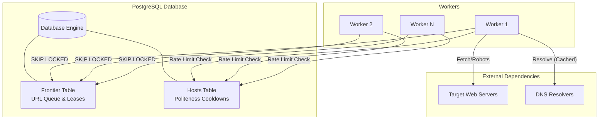

# Distributed Web Crawler

A high-performance, PostgreSQL-backed distributed web crawler designed with fault tolerance, host-level politeness, and measured horizontal scaling.

## Features

- **PostgreSQL Frontier**: Uses `SKIP LOCKED` for high-throughput, concurrent URL claiming across multiple workers.
- **Concurrent Workers**: Designed for horizontal scaling, allowing 1 to N independent workers to safely pull jobs from the frontier without deadlocks.
- **Fault Recovery & Zombie Protection**: Implements a lease system where URLs checked out by failed or unresponsive workers are automatically recovered and requeued.
- **Host-Level Politeness**: Enforces per-domain rate limits (cooldowns) via a distributed `hosts` table to avoid overwhelming target servers.
- **Robots.txt Compliance**: Respects server crawling rules before fetching pages.
- **DNS Resolver & Caching**: Custom DNS agent integration with in-memory caching to reduce DNS lookup overhead and speed up repeated domain fetches.
- **Recursive Crawling & Link Extraction**: Fully parses HTML, extracts anchor links, normalizes them, and safely enqueues newly discovered URLs up to a configurable depth limit.

## Architecture

The system revolves around stateless workers querying a centralized PostgreSQL database that acts as both the URL frontier and the distributed lock manager for host politeness.



## Scaling Benchmark

To validate the architecture, the crawler was benchmarked fetching a fixed workload of ~2,700 URLs from an initial seed. The metric used was **Fetched Pages per Minute (fetched/min)**, measured strictly over 60 seconds with depth discovery disabled (`MAX_DEPTH=0`) to keep the workload consistent.

| Workers | Fetched/min | Speedup | Scaling Efficiency |
|---:|---:|---:|---:|
| **1** | 63 | 1.00× | 100% |
| **4** | 209 | 3.32× | 83.0% |
| **8** | 281 | 4.46× | 55.8% |

### Benchmark Analysis

The results demonstrate a robust and expected scaling curve for distributed web crawling:
- **Strong Initial Scaling**: Moving from 1 to 4 workers yields a 3.32× speedup (83% efficiency), proving that the PostgreSQL `SKIP LOCKED` frontier effectively eliminates contention overhead.
- **Diminishing Returns (Politeness Bound)**: Moving to 8 workers flattens the curve (4.46× speedup). This represents the natural ceiling imposed by the crawler's host-level politeness locks. Because the test workload was concentrated on a few heavy domains (e.g., `github.blog`, `github.community`), additional workers spent their time politely waiting for domain cooldowns rather than hammering the same servers concurrently. This proves the distributed architecture is functioning exactly as intended and responsibly handling concurrency limitations!

## Quick Start

### 1. Database Setup
Start a PostgreSQL instance and set your `DATABASE_URL` in `.env`:
```env
DATABASE_URL=postgresql://user@localhost:5432/distributed_crawler
```

Run the schema migrations to create the `frontier` and `hosts` tables:
```bash
npx tsx src/db.ts # Assuming you have a setup script or apply manually
```

### 2. Start a Worker
```bash
MAX_DEPTH=2 npx tsx src/worker.ts worker-1
```
You can spawn as many workers as needed. The system will automatically handle locking and distribution.
